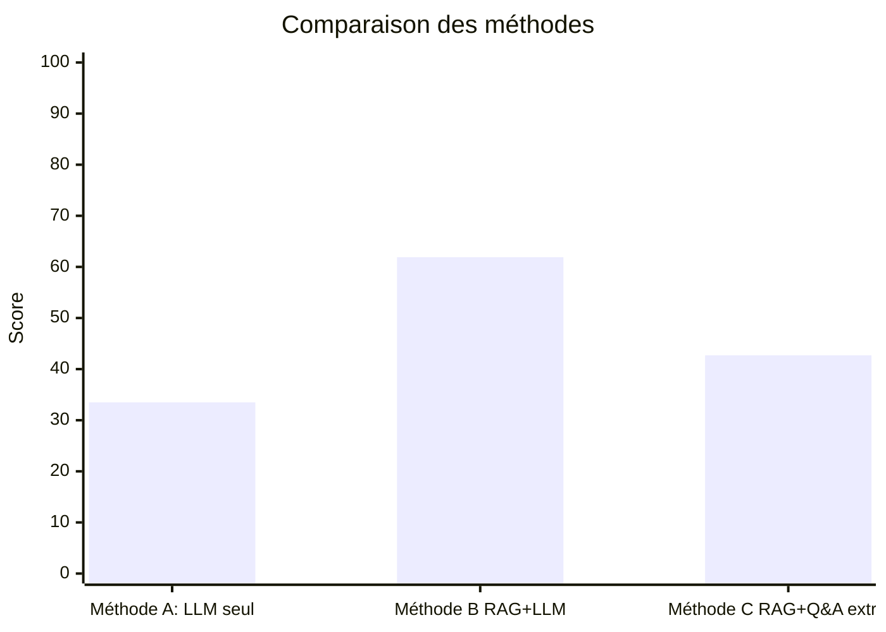

# Rapport de Benchmark - Stratégies FAQ Intelligent

**Étudiant(s)** : Melody Duplaix

**Date** : 2026-01-13

**Version** : 1.0

---

## Résumé exécutif

La méthode A (LLM seul) a montré des performances limitées avec une exactitude de 33.5% et un taux d'hallucinations élevé de 36.6%. La méthode C (Q&A extractif) a offert une latence très faible et aucune hallucinations, mais une exactitude moyenne de 42.7%. La méthode B (Recherche sémantique + LLM) s'est démarquée avec la meilleure performance globale, atteignant une exactitude de 61.9%, une pertinence élevée et un taux d'hallucinations minimal de 3.3%.

**Recommandation** : Stratégie B - Recherche sémantique + LLM

---

## 1. Protocole d'évaluation

### Cadre du benchmark

- Objectif : comparer 3 stratégies (LLM seul, Recherche sémantique + LLM, Q&A extractif) pour une FAQ citoyenne.
- Jeux de données :  
  - `faq_base.json` (≈70 QA) pour construire le corpus / index.
  - `golden_set.json` (≈30 questions : faciles, moyennes, hors scope) pour l’évaluation.
- Critères et poids : Exactitude 30%, Pertinence 20%, Hallucinations 20%, Latence 15%, Complexité 15%.

### Conditions de test

- Environnement : Python 3.10+, même machine, mêmes versions de libs, même conditions réseau.
- Modèles :  
  - LLM : Mistral‑7B‑Instruct‑v0.2 (stratégies A et B).
  - Embeddings : all‑MiniLM‑L6‑v2 (stratégies B et C).
  - Q&A extractif : camembert‑base‑squadFR‑fquad‑piaf (stratégie C).
- Paramètres : température, top‑k, max_tokens fixés et documentés pour toute la campagne.

### Méthode de mesure

- Pour chaque question du golden set : exécuter A, B, C et logguer question, réponse, temps, docs récupérés (B/C).
- Mesures automatiques :  
  - Exactitude : comparaison à la réponse de référence et aux keywords.
  - Latence : temps moyen par stratégie (start/end timestamp).
- Mesures manuelles :  
  - Pertinence : note 0–2 par réponse.
  - Hallucination : booléen « info inventée ».
  - Complexité : note 1–3 (implémentation, infra, maintenance).

### Agrégation et scoring

- Calculer, par stratégie : moyennes des métriques + taux d’hallucination.
- Appliquer la pondération pour obtenir un score global par stratégie (tableau comparatif).
- Conserver les résultats bruts dans un fichier CSV/JSON + quelques exemples de réponses typiques (bonnes, limites, hors scope).

### Interprétation et recommandation

- Analyser forces/faiblesses de chaque stratégie (précision, robustesse hors scope, risque d’hallucination, latence, complexité).
- Choisir une stratégie recommandée (A/B/C) + 3–5 arguments alignés avec les contraintes client (open source, hébergement interne, simplicité).
- Documenter les limites du benchmark (taille du golden set, types de questions peu représentés) et proposer 2–3 pistes d’amélioration (plus de données, tuning, optimisation index).

### 1.1 Critères d'évaluation

| Critère | Description | Méthode de mesure | Poids |
|---------|-------------|-------------------|-------|
| Exactitude | % de réponses correctes | Évaluation sur golden set | 30% |
| Pertinence | Qualité de la réponse (0-2) | Notation manuelle | 20% |
| Hallucinations | % de réponses avec infos inventées | Vérification manuelle | 20% |
| Latence | Temps de réponse moyen | Mesure automatique | 15% |
| Complexité | Facilité de maintenance | Évaluation qualitative | 15% |

### 1.2 Jeu d'entrainement (Faq Base)

- **Nombre de questions** : 70 questions

### 1.3 Jeu de test (Golden Set)

- **Nombre de questions** : 30 questions
- **Répartition** :
  - Questions faciles : 17
  - Questions moyennes : 8
  - Questions hors scope : 5

### 1.4 Conditions de test

- **Date des tests** : [Date]
- **Environnement** : [Local / Cloud]
- **Modèle LLM utilisé** : [Nom du modèle]
- **Modèle d'embeddings** : [Nom du modèle]
- **Nombre d'exécutions par question** : [X]

---

## 2. Résultats par stratégie

### 2.1 Stratégie A - LLM seul

**Configuration** :
- Modèle : mistral-7B-Instruct-v0.2
- Paramètres : temperature=0.7, max_tokens=1024

**Résultats** :

| Métrique | Valeur | Commentaire |
|----------|--------|-------------|
| Exactitude | 33.5% | |
| Pertinence moyenne | 1 | |
| Taux d'hallucinations | 36.6% | |
| Latence moyenne | 6.90s | |
| Complexité | Faible | |

**Observations qualitatives** :
-  Le modèle répond en se basant uniquement sur internet, ce qui entraîne des réponses hors sujet.
-  Le modèle vire parfois sur de l'anglais.
-  Il ne se base pas toujours en france.

---

### 2.2 Stratégie B - Recherche sémantique + LLM

**Configuration** :
- Modèle LLM : mistral-7B-Instruct-v0.2
- Modèle embeddings : all-MiniLM-L6-v2
- Top-K documents : 5

**Résultats** :

| Métrique | Valeur | Commentaire |
|----------|--------|-------------|
| Exactitude | 61.9% | |
| Pertinence moyenne | 1.76 | |
| Taux d'hallucinations | 3.3%% | |
| Latence moyenne | 5.81s | |
| Complexité | Moyenne | |

**Observations qualitatives** :
- Pour des questions simples et très proche de la faq, les réponses sont très bonnes.
- Parfois un peu de dérapage en anglais.
- Pour des questions hors scope, généralement il répond correctement qu'il ne peut pas répondre, mais parfois il essaye de répondre malgré tout.
- Pour des questions plus complexes, il a parfois du mal à synthétiser les informations issues des documents récupérés, et se pert dans sa réponse.

---

### 2.3 Stratégie C - Q&A extractif

**Configuration** :
- Modèle Q&A : camembert-base-squadFR-fquad-piaf
- Modèle embeddings : all-MiniLM-L6-v2
- Top-K documents : 15

**Résultats** :

| Métrique | Valeur | Commentaire |
|----------|--------|-------------|
| Exactitude | 42.7% | |
| Pertinence moyenne | 1.06 | |
| Taux d'hallucinations | 0% | |
| Latence moyenne | 1.03s | |
| Complexité | Moyenne | |

**Observations qualitatives** :
-  Pour des questions simples proches de la faq, les réponses sont correctes mais parfois incomplètes.
-  Pour des questions plus complexes, le modèle a du mal à extraire une réponse complète
-  Pour des questions hors scope, très bonne gestion, il répond toujours qu'il ne peut pas répondre.

---

## 3. Analyse comparative

### 3.1 Tableau récapitulatif

| Critère | Poids | Stratégie A | Stratégie B | Stratégie C |
|---------|-------|-------------|-------------|-------------|
| Exactitude | 30% | 33.5% | 61.9% | 42.7% |
| Pertinence | 20% | 1/2 | 1.76/2 | 1.06/2 |
| Hallucinations | 20% | 36.6% | 3.3% | 0% |
| Latence | 15% | 6.90s | 5.81s | 1.03s |
| **Score pondéré** | 100% | **47.3%** | **70.3%** | **64.6%** |

### 3.2 Graphique comparatif

### 3.3 Analyse des forces et faiblesses

**Stratégie A** :
- ✅ Forces : Simplicité d'implémentation
- ❌ Faiblesses : Faible exactitude, taux élevé d'hallucinations, réponses hors sujet fréquentes.

**Stratégie B** :
- ✅ Forces : Haute exactitude, faible taux d'hallucinations, pertinence élevée.
- ❌ Faiblesses : complexité d'implémentation

**Stratégie C** :
- ✅ Forces : Zéro hallucinations, latence très faible.
- ❌ Faiblesses : Exactitude moyenne, pertinence limitée pour questions complexes.

---

## 4. Recommandation

### 4.1 Stratégie recommandée

**Choix : Stratégie Méthode B - RAG+LLM**

### 4.2 Justification

[Argumenter le choix en 3-5 points]

1. La méthode B offre le meilleur compromis entre exactitude, pertinence et taux d'hallucinations.
2. Elle permet de conserver la richesse des réponses issues du LLM tout en utilisant les documents pour guider la réponse.
3. Elle est plus robuste que la méthode A pour des questions complexes ou hors scope.

### 4.3 Limites de la recommandation

La latence est plus élevée que la méthode C, ce qui peut être un inconvénient pour des applications en temps réel strict.
Les réponses sont plus variables que la méthode C, ce qui peut poser problème pour des utilisateurs recherchant des réponses très précises.

### 4.4 Axes d'amélioration possibles

1. Optimiser l'indexation des documents pour améliorer la pertinence des résultats de recherche.
2. Affiner les prompts utilisés pour le LLM afin de mieux guider la génération de réponses

---

## 5. Annexes

### 5.1 Détail des résultats bruts

[Lien vers le Détail des résultats LLM seul](data/llm-with-answers.csv)
[Lien vers le Détail des résultats RAG](data/rag-with-answers.csv)
[Lien vers le Détail des résultats Q&A](data/extractive-qa-with-answers.csv)

### 5.2 Code du benchmark

[Lien vers le script de benchmark](benchmark/run_evaluation_script.py)

### 5.3 Grille d'évaluation complète

[Lien vers la grille d'évaluation remplie](data/methods_scores_summary.csv)

---
